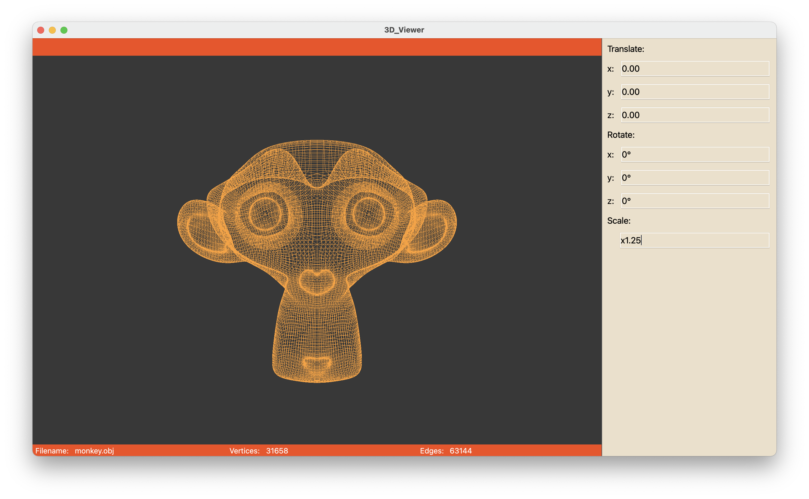
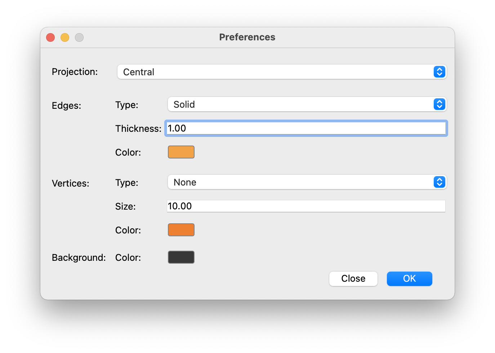

# 3D_Viewer
This is team project of application for viewing 3D wireframe models. I developed model part and helped with project architecture, OpenGL and interface logic.
### Notes
- Uses MVC and design patterns
- Uses QT Framework and OpenGL, but for educational purposes we've written affine transformations using our own `Matrix` class (source code in `src/libs/matrix` directory)
- Tests for Model provided in `src/test_dir` directory and can be run with `make tests` command from `src` directory. `make gcov_report` creates web-page with Coverage Report in `src/lcov_report_dir` directory
- FileReader class and TransformMatrix class have tests, to run from `src` directory use command `make tests` and `make lcov_report` for Coverage Report. Web-page `index.html` with coverage results will be in `src/lcov_report_dir`
- .tar archive of repository can be made from `src` directory using command `make dist`

## Build
To build from `src` directory use command `make`

## Install
### MacOS
To install from `src` directory use command `make install`

## Uninstall
### MacOS
To uninstall use `make uninstall` command from `src` directory

## Controls

### Basic
- To open .obj file in menu click on `File->Open file...` or use shortcut `⌘N`
- Model can be translated/rotated/scaled with spinboxes in the right. Model can be also rotated with mouse (Left-click and drag to rotate by X-axis and Z-axis; Right-click and drag to rotate by Y-axis and Z-axis)
### Preferences
 
Preferences are saved before closing the app
- Projection: Central or Parallel
- Edges preferences: Type (Solid or Dashed), Thickness and Color with colorpicker
- Vertices preferences: Type (None, Circle or Square), Size and Color with colorpicker
- Background Color with colorpicker
### Menu Tools
- Screenshot `⌘S` — saving the captured (rendered) images as bmp and jpeg files.
- Screencast `⌘C` — gif-animation (640x480, 10fps, 5s)
