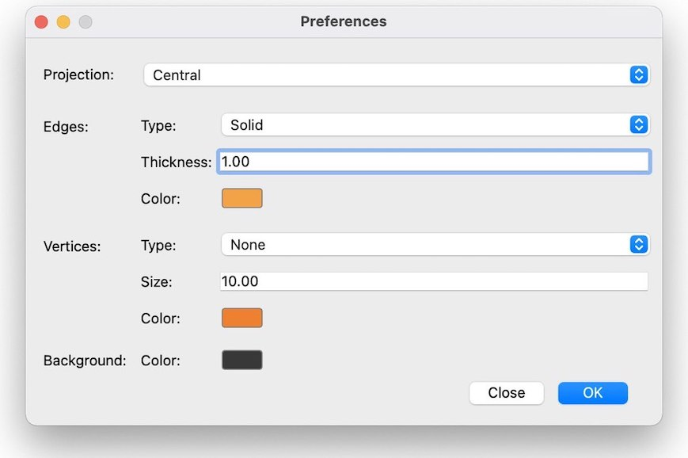

# 3D_Viewer
This is team project of application for viewing 3D wireframe models. 
### Notes
- Uses MVC and design patterns
- Uses QT Framework and OpenGL, but for educational purposes we've written affine transformations using our own `Matrix` class (source code in `src/libs/matrix` directory)
- Tests for Model provided in `src/test_dir` directory and can be run with `make tests` command from `src` directory. `make gcov_report` creates web-page with Coverage Report in `src/lcov_report_dir` directory

## Build
To build from `src` directory use command `make`

## Install
### MacOS
To install from `src` directory use command `make install`
### Linux
`cp -r build/3DViewer.app path/to/app/3DViewer.app`

## Controls

### Basic
- To open .obj file in menu click on `File->Open file...` or use shortcut `⌘N`
- Model can be translated/rotated/scaled with spinboxes in the right. Model can be also rotated with mouse (Left-click and drag to rotate by X-axis and Z-axis; Right-click and drag to rotate by Y-axis and Z-axis)
### Preferences

### Tools
